# 基础模型

## ViT
参考本地实验：`/home/darren/Deeplearning/test/vit.ipynb`

现有VLA算法的缺陷:
1. 数据采集成本高。
2. 预训练的VLA所使用的数据集与真机存在形态差异。
3. 泛化能力不足(本质是任务数据不够)
4. 训练过程难以被人为干预，调试难度高。

"π cross-embodiment robot dataset"是有用的，模型与硬件本体最好应该配套

## Foundation-VLA

### 1. 视觉处理链路

* **双视觉编码器 (DINOv2 + SigLIP)**：图中指出使用这两个模型进行融合，这正是 OpenVLA（基于 Prismatic VLM）的核心创新。
* **维度计算**：
* 输入图像 `224 x 224 x 3`。在 ViT-L/14 的设定下（Patch大小为 14x14），图像会被切分成 $(224/14) \times (224/14) = 16 \times 16 = \mathbf{256}$ 个 Patch。这与图中的 `256` 对应。
* **特征维度 2176 是怎么来的？** 这展示了制图者极高的专业度。DINOv2 (ViT-L) 的特征维度是 `1024`，SigLIP (ViT-SO400M) 的特征维度是 `1152`。两者拼接（Concat）后刚好是 `1024 + 1152 = 2176`！


* **投影层 (FusedMLP Projector)**：图中标注了 `2176 -> 4096`。因为 OpenVLA 的大脑是 LLaMA-2 7B，而 LLaMA-2 7B 的隐藏层维度（Hidden Size）正好是 `4096`。因此必须通过这个 MLP 把视觉特征对齐到语言模型的空间中。

### 2. 动作离散化 (Action Tokenization) 表达准确

* 图中提到将连续的动作值（如 `[0.1, -0.3, ...]`）通过 `ActionTokenizer` 转换为 `256 bins`，并映射到“词表末尾 token”。
* 这也是 RT 系列和 OpenVLA 的标准做法：将机器人连续的物理控制信号（通常缩放到 [-1, 1] 之间）离散化为 256 个档位，然后用大模型词表中平时用不到的（或者额外添加的）256 个 Token 来表示这些动作。这样大模型就可以像“作诗”一样“生成动作”。

### 3. 序列拼接与 LLaMA-2 输入结构清晰

* 图中的输入序列：`[BOS] [patch_1]...[patch_256] [text_tokens...]` 准确展示了多模态大模型的序列排布。视觉特征经过 MLP 后，变成了相当于 256 个“视觉单词”，放在人类的文本指令前面，一起喂给 LLaMA-2。

### 4. 训练细节（Loss 计算）

* 这是图中**最核心也最专业**的细节：**`Labels: [-100] [-100...-100] ... [action_1]...[action_7]`**。
* 在 PyTorch 中计算交叉熵损失（Cross-Entropy Loss）时，`ignore_index` 的默认值就是 `-100`。
* 图中标注“**仅在 action token 位置计算交叉熵损失**”，这完美解释了视觉-语言-动作模型在进行行为克隆（Behavior Cloning）时的做法。因为我们只希望模型学会“根据看到的和听到的去预测下一步动作”，而不需要模型去预测前面的图片长什么样或者复述人类的指令。因此，图片和指令部分的 Loss 被置为 `-100` 忽略掉，只对生成的 7 个动作（通常是机器臂的 6 自由度 + 1 个夹爪开合）进行梯度回传。


## VLA-OFT

### 一、整体架构

OpenVLA-OFT 是一个视觉-语言-动作模型（VLA），输入多模态信息，输出机器人连续动作。完整的数据流是：

**输入** → 视觉编码（SigLIP + DINOv2）→ MLP 投影 → 序列拼接 + Empty Action Embeddings → LLaMA 2（Backbone）→ MLP 动作头 → **K 步连续动作**

### 二、各模块解析

#### 视觉编码器：SigLIP + DINOv2

两者都是 ViT 的变种，结构相同（patch → token → Transformer），区别仅在训练目标：

- **SigLIP**：图文对比学习（sigmoid loss），学到语义和类别信息，理解语言指令，但空间细节弱
- **DINOv2**：无监督自蒸馏（student/teacher EMA），学到空间结构、纹理、几何细节，但不理解文字

两者互补：SigLIP 负责"做什么"，DINOv2 负责"在哪里、怎么抓"。两个编码器的 patch embedding 沿 hidden dimension 拼接后，经 MLP 投影到语言模型空间。**训练时两者本体冻结，直接使用预训练权重。**

#### Backbone：LLaMA 2（7B）

LLaMA 2 在这里不是用来生成文字的，而是作为**强大的序列建模器**，对拼接后的多模态 token 序列（图像 + 语言 + 状态 + empty action）做统一的上下文建模。它在预训练中习得的语义理解能力被迁移到机器人任务上。**训练时用 LoRA 微调（约 1% 参数更新）。**

#### MLP 投影层与动作头

- **MLP 投影层**：把视觉 embedding 和状态 embedding 映射到 LLaMA 2 的 embedding 空间，全量训练
- **MLP 动作头**：4 层 ReLU，把 LLaMA 2 最后一层的隐藏状态回归成连续动作值，用 L1 Loss 训练，全量训练（新增模块）

### 三、OFT 的核心创新点

#### 创新 1：并行解码（Parallel Decoding）

原版 OpenVLA 是自回归的：预测 K 步动作需要 K 次前向传播，速度慢。OFT 改为**一次前向传播输出全部 K 步动作**。

实现方式：在输入序列末尾拼接 K 个 Empty Action Embeddings（内容为空，只有位置编码各异），LLaMA 2 通过双向注意力同时"填充"所有占位符，并行输出 K 个动作。

#### 创新 2：双向注意力掩码

原版用因果掩码（下三角），action token 只能看到前面的 token，且 a₁ 看不到 a₂、a₃ 的位置。改为双向注意力后：

- 所有 action token 都能完整 attend 到全部上下文（图像 + 语言 + 状态）
- action token 之间通过位置编码互相感知，输出的 K 步动作在时间上更连贯一致

关键细节：双向的意义不在于 a₁ 看到 a₂ 的"内容"（那确实是空的），而在于每个 action token 能感知整条序列的结构，从而协调地输出连贯的动作块。

#### 创新 3：连续动作输出（替代离散 token）

原版 OpenVLA 把动作离散化为 256 个 bin 的 token，存在量化误差。OFT 用 MLP 动作头直接回归连续值，用 L1 Loss 训练，避免了离散化带来的精度损失。

#### 创新 4：FiLM 语言调制（OFT+ 专有）

在 SigLIP 和 DINOv2 的 Transformer 块内部插入 FiLM 层，用语言指令的平均 embedding 对视觉特征做仿射变换（scale + shift）。效果是让视觉编码器"知道当前任务是什么"，提升语言-视觉对齐质量。视觉编码器本体仍冻结，只有 FiLM 层的参数参与训练。

#### 创新 5：Action Chunking（动作分块）

预测的不是单步动作，而是未来 K 步的动作序列。只需在输入中增加 K 个 empty token 即可扩展，推理时 K 步动作一起执行，减少与环境的交互频率，提升执行流畅度。

### 一些其他要点
#### 0.Loss 的设计

Loss 是对整个 action chunk 的平均 L1 距离：

$$\mathcal{L}_{OFT} = \frac{1}{K} \sum_{k=0}^{K-1} \|\hat{a}_{t+k} - a_{t+k}\|_1$$

其中 $\hat{a}$ 是预测动作，$a$ 是示范数据中的 ground truth，K 是 chunk 大小。动作在训练前被归一化到 $[-1, +1]$，训练目标是让归一化后的平均 L1 loss 降到 0.01 以下，达到后停止训练。

为什么选 L1 而不是 L2 或 diffusion？论文做了三种 loss 的对比实验：

- **Cross-entropy（原版 OpenVLA）**：适用于离散 token，但离散化损失精度
- **L1 regression**：连续动作，训练快，推理单次前向
- **Diffusion（去噪扩散）**：连续动作，理论表达力更强，但推理需要 50 步去噪

实验结果显示 L1 regression 和 diffusion 在任务成功率上性能相当，但 L1 的训练收敛更快，推理速度显著更高。

L1 还有一个实用好处：L1 regression 训练的 action head 让评估结果在不同随机种子下不会有差异，而 diffusion 或 flow matching 类模型则不然。这对实验可复现性很有价值。

L1 相比 L2 的优势在于对异常值（outlier 动作）鲁棒性更强——L2 会对大误差施加平方惩罚，容易被少数奇怪的示范数据拉偏；L1 的惩罚是线性的，更倾向于学习"中位数"而非"均值"。

#### 1. 数据过滤是训练成功的隐藏因素

训练时过滤掉了动作幅度接近零的步骤以及失败的示范轨迹。机器人示范数据里有大量"停在原地不动"的帧，如果不过滤，模型会学到一个"尽量少动"的偏置。

#### 2. 图像增强是标配

训练时使用了 90% 随机裁剪加上颜色抖动（亮度、对比度、饱和度、色相）。这不是可选项，而是**防止模型过拟合特定相机角度**和**光照条件**的必要手段。

#### 3. FiLM (feature-wise linear modulation)的实现细节决定成败

用一个外部信号（这里是语言指令）生成两个向量 γ 和 β，对另一个网络的特征图做逐元素的缩放和平移。
$$\text{FiLM}(F) = \gamma \odot F + \beta $$
F 是被调制的特征，$\gamma$ 和 $\beta$由语言 embedding 经过一个小 MLP 生成。

> 实现细节：对每个 patch embedding 独立调制会导致更弱的语言 grounding。正确做法是对每个隐藏维度统一 scale 和 shift，即 γ 和 β 是 $D_{ViT}$ 维向量，对所有 patch embedding 的同一维度施加相同的调制——这与 CNN 中 FiLM 在空间维度上的作用方式一致。

直觉上：如果对每个 patch 独立调制，模型可以让不同位置的 patch 受到不同程度的语言影响，反而产生混乱；统一调制则是在特征空间维度上"旋转整个视觉表征"，更干净。

**FiLM 插在哪里？**
FiLM 层被插入 SigLIP 和 DINOv2 内部每个 Transformer block 的 LayerNorm 之后、注意力层之前。每个 block 有独立的一对 γ/β MLP（参数不共享），但所有 block 的语言输入都是同一个——指令的平均 token embedding（对所有语言 token 求均值得到一个固定向量）。
> 也就是说：在 SigLIP 和 DINOv2 内部，语言指令就已经在调制视觉特征的生成方式了
#### 4. Open-loop 执行策略

推理时执行完整的 action chunk 后，再重新查询模型规划下一个 chunk，而不是每步都重新规划。这个 open-loop 执行策略是让速度达到 25Hz 的关键——如果每步都重新推理，延迟会叠加。代价是在 chunk 执行中途无法对意外情况做出响应，这是论文中明确承认的局限之一。
意思是：拿到这 K 步动作后，机器人把它们全部执行完（不中途重规划），执行完了再触发下一次推理。

#### 5. 预训练表征的贡献可量化

消融实验表明，去掉 OpenVLA 的预训练（直接用底层 VLM 做 OFT 微调）会导致平均成功率下降 5.2%。这验证了一件事：即使微调方式与预训练差异很大（自回归→并行、离散→连续），预训练积累的表征仍然有效迁移，不能跳过。
### 四、训练策略

| 模块 | 训练状态 | 原因 |
|---|---|---|
| SigLIP / DINOv2 本体 | 冻结 | 预训练表征已足够好，机器人数据量不足以重训 |
| FiLM 层（OFT+） | 训练 | 轻量，用于语言调制视觉特征 |
| MLP 投影层 | 全量训练 | 需要学习跨模态对齐 |
| LLaMA 2 | LoRA 微调 | 保留通用能力，只更新任务相关方向 |
| MLP 动作头 | 全量训练 | 全新模块，从零学习动作回归 |

### 五、思考

**Q：双向注意力对 empty action token 有什么实质作用？**
empty token 的内容是空的，但位置编码各异。双向注意力让每个 action token 的 query 能 attend 到整条序列，形成包含完整上下文的隐藏状态，再由 MLP 动作头回归动作值。核心收益是：所有 action token 平等、完整地获取上下文信息，不像因果掩码那样"越靠前的 token 信息越不完整"。

**Q：新任务一定要重新训练吗？**
不一定。语言指令的变体（同类任务的不同描述）可以靠 LLaMA 2 的语言泛化能力处理。但全新的物理技能类型需要新数据，用 LoRA 微调，几十到几百条轨迹通常足够——因为底层的视觉理解和运动协调能力已在预训练中习得。


### 六、代码阅读入口

**第一：`prismatic/extern/hf/modeling_prismatic.py`**

这是整个模型的核心文件，所有你学过的概念都在这里实现：
- Empty Action Embeddings 如何拼接到输入序列
- 双向注意力掩码如何替换因果掩码
- FiLM 层的具体插入方式
- MLP 动作头的前向传播
- L1 Loss 的计算逻辑
- diffusion 分支的代码（作为对比理解为什么选 L1）

**第二：`vla-scripts/finetune.py`**

训练脚本，重点关注几处：
- LoRA 是怎么用 `peft` 库挂上去的，几行代码就能看懂
- 数据过滤（no-op 动作过滤）在哪里做
- 图像增强的参数在哪里配置
- 学习率 decay 策略

训练命令里的每个 `--` 参数在这个文件里都有对应的逻辑，读命令行参数是进入代码的最好入口。

**第三：`experiments/robot/openvla_utils.py`**

推理工具函数，README 里的 Quick Start 代码用的都是这里的函数。`get_vla_action` 是最值得看的——它展示了一次完整推理的流程：图像预处理 → 拼序列 → 前向传播 → 动作 unnormalize → 返回。

## Diffusion Model

[论文原文 · arXiv:2208.11970](https://arxiv.org/pdf/2208.11970)

## 双臂foundation：RDT-1B

### 一、核心问题与贡献

#### 1.1 解决什么问题？

双臂操控（Bimanual Manipulation）是机器人领域的核心任务，但构建其基础模型面临两大瓶颈：

| 挑战       | 具体表现                                    |
| -------- | --------------------------------------- |
| **数据稀缺** | 双臂系统硬件成本高，可用轨迹数 < 10K，与基础模型数据需求差距达三个数量级 |
| **架构局限** | 动作空间维度翻倍 → 多模态动作分布；跨机器人数据异构性导致负迁移风险     |


#### 1.2 核心贡献（3点）

1. **RDT模型**：基于 Diffusion Transformer，专为双臂操控设计的可扩展架构，参数量达 **1.2B**，是目前最大的扩散式机器人操控基础模型
2. **物理可解释统一动作空间（Physically Interpretable Unified Action Space）**：解决跨机器人数据异构问题
3. **大规模预训练 + 微调流程**：46个数据集、1M+ 轨迹预训练，自建 6K+ 双臂数据集微调

### 二、问题形式化（Section 3）

#### 2.1 任务定义

语言条件双臂视觉运动控制（Language-Conditioned Bimanual Manipulation with Vision）：

- **输入**：语言指令 $\ell$，观测 $o_t = (X_{t-T_{img}+1:t+1}, z_t, c)$
  - $X$：RGB 图像历史（3个相机视角，历史长度 $T_{img}=2$）
  - $z_t$：机器人本体感知（proprioception）
  - $c$：控制频率
- **输出**：动作 $a_t$（目标姿态的一个子集）
- **目标机器人**：ALOHA 双臂机器人

#### 2.2 两大技术挑战

**Challenge 1：如何设计强大架构？**
- 表达能力：需捕捉双臂动作的多模态分布（抓取同一物体有多种可行模式）
- 可扩展性：需高效处理文本、图像、动作等异构多模态输入，并稳定地进行大规模训练

**Challenge 2：如何在异构数据上训练？**
- 不同机器人的物理结构和动作空间差异巨大
- 现有方案要么限制机器人子集（丢失多样性），要么只保留共有特征（丢失信息）

### 三、RDT 模型架构（Section 4.1）

#### 3.1 为什么选扩散模型？

- 双臂任务天然存在多模态动作分布
- 若用确定性映射 $(l, o_t) \mapsto a_t$ 做回归，模型会学到多个模式的"平均"，可能产生不可行动作
- 扩散模型擅长表达复杂分布，且动作维度远低于图像，采样开销小
- **数学形式**：对动作块（action chunk）$a_{t:t+T_a}$ 建模分布 $p(a_{t:t+T_a}|\ell, o_t)$

#### 3.2 机器人数据的特殊性（与图像数据的区别）

| 属性 | 图像/视频数据 | 机器人物理量 |
|------|--------------|-------------|
| 时间变化 | 帧间渐变、空间连续 | 非线性动力学、高频突变 |
| 数值范围 | 相对稳定 | 不稳定（传感器极值影响） |
| 建模难点 | — | 碰撞、约束、材料阻尼等物理交互 |

这些特性要求对标准 DiT 做专门改造。

#### 3.3 多模态输入编码

| 输入类型 | 编码方式 | 说明 |
|---------|---------|------|
| 低维输入（本体感知、动作块、控制频率） | MLP + 傅里叶特征 | 有效捕获低维空间的高频变化 |
| 图像输入 | 冻结 **SigLIP**（图文对齐预训练视觉编码器）| 提取紧凑的空间语义表示 |
| 语言输入 | 冻结 **T5-XXL** | 处理变长、高度抽象的指令 |

**额外设计——随机独立 Masking**：各模态以10%概率独立随机掩码，防止模型过度依赖单一输入（尤其防止外部相机主导而忽视手腕相机细节）。

**多维位置编码（Multi-Dimensional Positional Embedding）**：
- 维度：$(T_{img}, N_{cam}, N_{patch}, D)$
- 同时编码时间步与相机视角信息，帮助模型区分不同时刻、不同视角的图像

#### 3.4 网络结构：对 DiT 的三项关键改造

**改造一：QKNorm + RMSNorm（稳定训练）**

- **问题**：机器人物理量数值范围不稳定 → 大规模预训练时出现梯度不稳定/数值溢出
- **解决**：
  - 在注意力层加入 **QKNorm**（Query-Key 归一化），避免计算注意力时的数值不稳定
  - 将 LayerNorm 替换为 **RMSNorm**（去掉中心化操作），防止时序对称性被破坏
- **实验验证**：无此改造时，大规模预训练 loss 曲线极不稳定甚至爆炸

**改造二：MLP 解码器（提升非线性拟合能力）**

- **问题**：原始 DiT 使用线性解码器，无法有效拟合机器人动作的非线性动力学
- **解决**：将最终线性层替换为非线性 **MLP 解码器**，提升从潜空间到物理空间的投影能力
- **实验验证**：去掉 MLP 解码器后，模型在 Robot Dog 等精细操控任务上成功率显著下降

**改造三：交替条件注入（Alternating Condition Injection, ACI）**

- **背景**：图像/语言作为条件，长度可变，无法用原始 DiT 的 adaptive layer norm（单 token 压缩）
- **基础方案**：改用 **Cross-Attention** 注入条件
- **问题**：图像 token 数量远多于语言 token，同时注入会淹没语言相关信息，损害指令跟随能力
- **解决**：在相邻层中**交替注入**图像 token 和语言 token（偶数层注图像，奇数层注语言），避免模态失衡
- **实验验证**：去掉 ACI 后，指令跟随（Pour Water）任务的正确率从 62.5% 跌至 12.5%

#### 3.5 Action Chunking 技术

- 一次预测 $T_a = 64$ 步动作块，而非逐步预测
- 好处：减少决策次数 → 降低误差累积；提升时序一致性
- 注意：不输入历史本体感知 $z_{i<t}$，防止模型走捷径（仅依赖低维输入而忽视图像特征）

#### 3.6 推理加速

- 训练时：DDPM 调度器，1000步去噪
- 推理时：采用 **DPM-Solver++**，将去噪步数从100步压缩至 **5步**
- 推理频率：动作块 6 Hz，单动作 381 Hz（ALOHA机器人载 RTX 4090）

---

### 四、统一动作空间（Section 4.2）

#### 4.1 核心思想

跨机器人训练的关键是为各种机器人建立统一的动作表示，且每个维度需有明确的物理意义。

**设计思路**：
1. 每个机器人的动作 $a_t$ 通常是目标本体感知 $z_{t+1}$ 的子集，因此 $z_t$ 的空间自然包含 $a_t$ 的空间
2. 设计一个涵盖几乎所有带夹爪机械臂机器人主要物理量的统一空间

**维度**：128维向量，按以下物理意义分配：

| 索引范围 | 物理量 |
|---------|--------|
| [0, 10) | 右臂关节位置 |
| [10, 15) | 右夹爪关节位置 |
| [15, 25) | 右臂关节速度 |
| [25, 30) | 右夹爪关节速度 |
| [30, 33) | 右末端执行器位置（xyz）|
| [33, 39) | 右末端执行器6D姿态 |
| [39, 45) | 右末端执行器速度/角速度 |
| [50–99] | 左臂对称结构（与右臂镜像） |
| [100, 103) | 底盘线速度/角速度 |
| [103, 128) | 保留 |

**填充策略**：将具体机器人的动作向量按物理意义填入对应位置，其余维度置零；同时拼接一个0-1可用性指示向量（共256维），消除"0值=静止"与"0值=填充"的歧义。

#### 4.2 物理可解释性的意义

- 不同机器人之间的共享物理规律（如关节力学、末端执行器运动学）可被模型直接学习
- 避免了数值归一化到 $[-1,1]$ 或 $\mathcal{N}(0,1)$ 所破坏的跨机器人物理对应关系
- EEF旋转使用6D表示（而非欧拉角），避免万向节死锁（Gimbal Lock）问题

---

### 五、数据（Section 4.2）

#### 5.1 预训练数据集

| 指标 | 数量 |
|------|------|
| 数据集数量 | **46个** |
| 轨迹总量 | **1M+** |
| 数据总量 | **21TB** |

- 包含 RT-1（130K轨迹）、DROID（76K轨迹）、RH20T（110K轨迹）、BridgeData V2 等主要数据集
- 采样权重：以 $p\sqrt{N_j}$ 为初始权重，防止大数据集过度主导，同时保证小数据集的多样性
- 数据清洗：去除重复轨迹、失败轨迹、空白图像、错误速度记录、过短轨迹

#### 5.2 微调数据集（自建）

| 指标 | 数量 |
|------|------|
| 任务数 | **300+** |
| 轨迹数 | **6K+** |
| 帧数 | **3M+** |
| 场景数 | **15+** |
| 物体数 | **100+** |

**三大质量保证维度**：

1. **多样性**：多场景（15+）、多物体（刚体/柔性体，不同尺寸纹理）、随机初始位置、随机光照
2. **指令多样性**：人工标注基础指令 + GPT-4-Turbo 扩展生成100条扩展指令 + 1条简化指令
3. **任务挑战性**：涵盖抓取、插接、书写、推拉等多种技能；包含灵巧操控（拧瓶盖）和语言理解（拼字）等高难度任务

---

### 六、关键设计决策汇总

```
双臂操控基础模型
│
├── 表达能力 → 扩散模型（建模多模态动作分布）
│
├── 机器人数据适配
│   ├── QKNorm + RMSNorm（解决数值不稳定）
│   ├── MLP 解码器（拟合非线性动力学）
│   └── 交替条件注入 ACI（平衡语言/图像模态）
│
├── 跨机器人训练
│   ├── 统一动作空间（128维，物理意义对齐）
│   └── 可用性指示向量（消除零值歧义）
│
├── 多模态输入
│   ├── 冻结 SigLIP（图像）
│   ├── 冻结 T5-XXL（语言）
│   ├── MLP+傅里叶特征（低维量）
│   ├── 多维位置编码（时间+相机视角）
│   └── 随机独立 Masking（防模态偏差）
│
└── 训练策略
    ├── 预训练：46数据集 / 1M轨迹 / 48×H100 / 1M步
    ├── 微调：6K+双臂轨迹 / 130K步
    └── 推理加速：DPM-Solver++（100步→5步）
```

### 七、阅读要点与个人理解
#### LayerNorm 和 RMSNorm 的公式对比：

**LayerNorm：**

$$\text{LayerNorm}(x) = \gamma \cdot \frac{x - \mu}{\sqrt{\sigma^2 + \epsilon}} + \beta$$

其中 $\mu = \frac{1}{n}\sum x_i$，$\sigma^2 = \frac{1}{n}\sum (x_i - \mu)^2$，有 $\gamma$（缩放）和 $\beta$（偏移）两个可学习参数。

**RMSNorm：**

$$\text{RMSNorm}(x) = \gamma \cdot \frac{x}{\sqrt{\frac{1}{n}\sum x_i^2 + \epsilon}}$$

分母是 Root Mean Square，只有 $\gamma$ 一个可学习参数，**去掉了中心化（减均值）和偏移项 $\beta$**。

为什么用 RMSNorm ？

原因在于"中心化"操作对机器人数据有害。LayerNorm 的 $x - \mu$ 会把一个时间步内所有维度的值都向均值对齐，这在图像特征上无害（像素分布相对平稳），但机器人数据的不同维度物理意义截然不同——关节角度、末端执行器位置、夹爪状态混在同一向量里，强行减去它们的均值会破坏各维度之间的相对数值关系，即**时序对称性**。RMSNorm 只做缩放，不做平移，保留了这种跨维度的数值结构，大规模预训练时训练曲线更稳定。

#### 值得深思的设计
- 不输入历史本体感知 $z_{i<t}$：强制模型从图像中学习决策，而非依赖低维捷径
- 交替注入（而非拼接）图像和语言：解决了 token 数量不平衡问题，是比较细腻的工程优化
- 控制频率 $c$ 作为模型输入：优雅地处理了不同数据集控制频率不一致的问题

#### 局限性（从论文中推断）
- 由于 Embodiment Gap，预训练模型无法零样本泛化到训练未见的机器人平台
- 推理频率（6 Hz 动作块）可能不足以应对高动态任务
- 预训练数据仍以单臂为主，双臂数据相对有限


## LoRA（Low-Rank Adaptation）微调

### 一、LoRA 核心思想

**问题**：全量微调大模型时，参数更新量 $\Delta W$ 维度过高（如 $d \times k$），存储和计算成本巨大。

**洞察**：预训练权重 $W_0$ 已经学到了丰富的特征表示，微调时只需要**低秩的增量** $\Delta W$ 即可适应下游任务。

**方案**：将 $\Delta W$ 分解为两个低秩矩阵的乘积：
$$W = W_0 + \Delta W = W_0 + BA$$

其中：
- $W_0 \in \mathbb{R}^{d \times k}$：预训练权重（**冻结**，不更新）
- $B \in \mathbb{R}^{d \times r}$：可训练矩阵
- $A \in \mathbb{R}^{r \times k}$：可训练矩阵
- $r \ll \min(d, k)$：低秩维度（通常 4~64）

**参数量对比**：
- 全量微调：$d \times k$ 个参数
- LoRA：$d \times r + r \times k = r(d+k)$ 个参数
- 节省比例：$\frac{r(d+k)}{dk}$，当 $r=8, d=k=4096$ 时，仅需 **0.4%** 的参数

---

### 二、一层 MLP 的 LoRA 实现

```python
import torch
import torch.nn as nn
import torch.nn.functional as F
import math

class LoRALayer(nn.Module):
    """
    通用 LoRA 层：W = W_0 + BA
    可以包装任何 nn.Linear 层
    """
    def __init__(self, in_features, out_features, rank=4, lora_alpha=1.0):
        super().__init__()
        self.rank = rank
        self.lora_alpha = lora_alpha
        self.scaling = lora_alpha / rank  # 缩放因子
        
        # 冻结的预训练权重（实际使用时从预训练模型加载）
        self.weight = nn.Parameter(torch.zeros(out_features, in_features), requires_grad=False)
        self.bias = nn.Parameter(torch.zeros(out_features), requires_grad=False) if True else None
        
        # LoRA 可训练参数：B (out x r) 和 A (r x in)
        # 初始化策略：A 用高斯初始化，B 初始化为零（保证训练开始时 ΔW=0）
        self.lora_A = nn.Parameter(torch.randn(rank, in_features) * 0.01)
        self.lora_B = nn.Parameter(torch.zeros(out_features, rank))
        
    def forward(self, x):
        # 原始输出：x @ W_0^T
        original = F.linear(x, self.weight, self.bias)
        # LoRA 增量：x @ A^T @ B^T * scaling
        lora_delta = F.linear(F.linear(x, self.lora_A.T), self.lora_B.T) * self.scaling
        return original + lora_delta


class LoRAMLP(nn.Module):
    """
    一层 MLP + LoRA 微调的完整示例
    结构：输入 -> Linear + LoRA -> ReLU -> Linear + LoRA -> 输出
    """
    def __init__(self, input_dim=784, hidden_dim=256, output_dim=10, lora_rank=8):
        super().__init__()
        
        # 预训练时训练的完整层（微调时冻结）
        self.fc1 = nn.Linear(input_dim, hidden_dim)
        self.fc2 = nn.Linear(hidden_dim, output_dim)
        self.relu = nn.ReLU()
        
        # 用 LoRA 包装两层
        self.lora_fc1 = LoRALayer(input_dim, hidden_dim, rank=lora_rank)
        self.lora_fc2 = LoRALayer(hidden_dim, output_dim, rank=lora_rank)
        
        # 将预训练权重复制到 LoRA 层并冻结原始层
        self._init_from_pretrained()
        
    def _init_from_pretrained(self):
        """模拟从预训练模型加载：复制权重到 LoRA 层，冻结原始层"""
        # 复制权重到 LoRA 层
        self.lora_fc1.weight.data = self.fc1.weight.data.clone()
        self.lora_fc1.bias.data = self.fc1.bias.data.clone()
        self.lora_fc2.weight.data = self.fc2.weight.data.clone()
        self.lora_fc2.bias.data = self.fc2.bias.data.clone()
        
        # 冻结原始层（不再参与训练）
        for param in [self.fc1.weight, self.fc1.bias, 
                      self.fc2.weight, self.fc2.bias]:
            param.requires_grad = False
            
    def forward(self, x):
        # 使用 LoRA 层进行前向传播
        x = self.lora_fc1(x)
        x = self.relu(x)
        x = self.lora_fc2(x)
        return x
    
    def get_trainable_params(self):
        """统计可训练参数"""
        total = sum(p.numel() for p in self.parameters())
        trainable = sum(p.numel() for p in self.parameters() if p.requires_grad)
        return {
            'total_params': total,
            'trainable_params': trainable,
            'frozen_params': total - trainable,
            'ratio': f"{trainable/total*100:.2f}%"
        }


# ============ 使用示例 ============

def demo_lora_mlp():
    # 创建模型（模拟预训练后加载）
    model = LoRAMLP(input_dim=784, hidden_dim=256, output_dim=10, lora_rank=8)
    
    # 查看参数统计
    stats = model.get_trainable_params()
    print(f"总参数: {stats['total_params']:,}")
    print(f"可训练参数: {stats['trainable_params']:,}")
    print(f"冻结参数: {stats['frozen_params']:,}")
    print(f"训练比例: {stats['ratio']}")
    
    # 模拟微调
    batch_size = 32
    x = torch.randn(batch_size, 784)
    y = torch.randint(0, 10, (batch_size,))
    
    optimizer = torch.optim.Adam(
        filter(lambda p: p.requires_grad, model.parameters()), 
        lr=1e-3
    )
    criterion = nn.CrossEntropyLoss()
    
    # 训练一步
    model.train()
    output = model(x)
    loss = criterion(output, y)
    loss.backward()
    optimizer.step()
    
    print(f"\nLoss: {loss.item():.4f}")
    print("LoRA A grad norm:", model.lora_fc1.lora_A.grad.norm().item())
    print("LoRA B grad norm:", model.lora_fc1.lora_B.grad.norm().item())
    print("原始层 requires_grad:", model.fc1.weight.requires_grad)  # False

demo_lora_mlp()
```

**输出示例**：
```
总参数: 203,530
可训练参数: 8,264        ← 仅 4.06% 的参数参与训练！
冻结参数: 195,266
训练比例: 4.06%
Loss: 2.3124
LoRA A grad norm: 0.0234
LoRA B grad norm: 0.0156
原始层 requires_grad: False
```

---

### 三、Llama 模型的 LoRA 实现

Llama 中主要对 **Q、K、V 投影矩阵** 和 **门控/上投影层** 应用 LoRA。

```python
import torch
import torch.nn as nn
import torch.nn.functional as F
import math
from typing import Optional, Tuple

class LlamaLoRAConfig:
    """LoRA 配置"""
    r: int = 8                    # 低秩维度
    lora_alpha: float = 16.0      # 缩放参数
    lora_dropout: float = 0.05    # dropout
    target_modules: list = None   # 目标模块名
    
    def __init__(self):
        self.target_modules = [
            "q_proj", "k_proj", "v_proj", "o_proj",  # Attention
            "gate_proj", "up_proj", "down_proj"       # FFN
        ]


class LinearLoRA(nn.Module):
    """
    兼容 HuggingFace 风格的 LoRA Linear 层
    替换 nn.Linear，支持 merge/unmerge
    """
    def __init__(self, base_layer: nn.Linear, r: int = 8, lora_alpha: float = 16.0, 
                 lora_dropout: float = 0.0):
        super().__init__()
        self.base_layer = base_layer
        self.r = r
        self.lora_alpha = lora_alpha
        self.scaling = lora_alpha / r
        
        in_features = base_layer.in_features
        out_features = base_layer.out_features
        
        # LoRA 参数
        self.lora_dropout = nn.Dropout(lora_dropout) if lora_dropout > 0 else nn.Identity()
        self.lora_A = nn.Parameter(torch.randn(r, in_features) * 0.01)
        self.lora_B = nn.Parameter(torch.zeros(out_features, r))
        
        # 冻结基础层
        for param in self.base_layer.parameters():
            param.requires_grad = False
            
        self.merged = False  # 是否已合并权重（推理优化）
        
    def forward(self, x: torch.Tensor) -> torch.Tensor:
        if self.merged:
            # 推理时直接计算，避免额外开销
            return F.linear(x, self.base_layer.weight, self.base_layer.bias)
        
        # 基础输出
        base_output = self.base_layer(x)
        
        # LoRA 分支: x -> dropout -> A^T -> B^T -> scale
        lora_output = F.linear(
            F.linear(self.lora_dropout(x), self.lora_A.T), 
            self.lora_B.T
        ) * self.scaling
        
        return base_output + lora_output
    
    def merge(self):
        """将 LoRA 权重合并到基础层，加速推理"""
        if self.merged:
            return
        
        # W_merged = W_0 + B * A * scaling
        delta_W = (self.lora_B @ self.lora_A) * self.scaling
        self.base_layer.weight.data += delta_W
        
        self.merged = True
        
    def unmerge(self):
        """取消合并"""
        if not self.merged:
            return
        # 恢复原始权重
        delta_W = (self.lora_B @ self.lora_A) * self.scaling
        self.base_layer.weight.data -= delta_W
        self.merged = False


class LlamaAttentionLoRA(nn.Module):
    """
    Llama Attention 层 + LoRA
    对 Q, K, V, O 投影应用 LoRA
    """
    def __init__(self, hidden_size: int, num_heads: int, num_kv_heads: int, 
                 config: LlamaLoRAConfig):
        super().__init__()
        self.hidden_size = hidden_size
        self.num_heads = num_heads
        self.num_kv_heads = num_kv_heads
        self.head_dim = hidden_size // num_heads
        
        # 原始投影层（预训练权重）
        self.q_proj = nn.Linear(hidden_size, num_heads * self.head_dim, bias=False)
        self.k_proj = nn.Linear(hidden_size, num_kv_heads * self.head_dim, bias=False)
        self.v_proj = nn.Linear(hidden_size, num_kv_heads * self.head_dim, bias=False)
        self.o_proj = nn.Linear(num_heads * self.head_dim, hidden_size, bias=False)
        
        # 用 LoRA 包装目标层
        if "q_proj" in config.target_modules:
            self.q_proj = LinearLoRA(self.q_proj, r=config.r, 
                                      lora_alpha=config.lora_alpha,
                                      lora_dropout=config.lora_dropout)
        if "k_proj" in config.target_modules:
            self.k_proj = LinearLoRA(self.k_proj, r=config.r,
                                      lora_alpha=config.lora_alpha,
                                      lora_dropout=config.lora_dropout)
        if "v_proj" in config.target_modules:
            self.v_proj = LinearLoRA(self.v_proj, r=config.r,
                                      lora_alpha=config.lora_alpha,
                                      lora_dropout=config.lora_dropout)
        if "o_proj" in config.target_modules:
            self.o_proj = LinearLoRA(self.o_proj, r=config.r,
                                      lora_alpha=config.lora_alpha,
                                      lora_dropout=config.lora_dropout)
        
        self.rotary_emb = RotaryEmbedding(self.head_dim)  # 简化的 RoPE
        
    def forward(self, hidden_states: torch.Tensor, 
                attention_mask: Optional[torch.Tensor] = None) -> torch.Tensor:
        batch_size, seq_len, _ = hidden_states.shape
        
        # Q, K, V 投影（带 LoRA）
        q = self.q_proj(hidden_states)
        k = self.k_proj(hidden_states)
        v = self.v_proj(hidden_states)
        
        # reshape 为多头
        q = q.view(batch_size, seq_len, self.num_heads, self.head_dim).transpose(1, 2)
        k = k.view(batch_size, seq_len, self.num_kv_heads, self.head_dim).transpose(1, 2)
        v = v.view(batch_size, seq_len, self.num_kv_heads, self.head_dim).transpose(1, 2)
        
        # 应用 RoPE
        q, k = self.rotary_emb(q, k, seq_len)
        
        # 缩放点积注意力
        attn_output = self.scaled_dot_product_attention(q, k, v, attention_mask)
        
        # 输出投影（带 LoRA）
        attn_output = attn_output.transpose(1, 2).contiguous().view(batch_size, seq_len, -1)
        output = self.o_proj(attn_output)
        
        return output
    
    def scaled_dot_product_attention(self, q, k, v, mask=None):
        scores = torch.matmul(q, k.transpose(-2, -1)) / math.sqrt(self.head_dim)
        if mask is not None:
            scores = scores + mask
        attn = F.softmax(scores, dim=-1)
        return torch.matmul(attn, v)


class LlamaMLPLoRA(nn.Module):
    """
    Llama FFN (SwiGLU) + LoRA
    """
    def __init__(self, hidden_size: int, intermediate_size: int, 
                 config: LlamaLoRAConfig):
        super().__init__()
        # SwiGLU: gate_proj 控制门控，up_proj 是上采样，down_proj 是下采样
        self.gate_proj = nn.Linear(hidden_size, intermediate_size, bias=False)
        self.up_proj = nn.Linear(hidden_size, intermediate_size, bias=False)
        self.down_proj = nn.Linear(intermediate_size, hidden_size, bias=False)
        self.act_fn = nn.SiLU()
        
        # 应用 LoRA
        if "gate_proj" in config.target_modules:
            self.gate_proj = LinearLoRA(self.gate_proj, r=config.r,
                                         lora_alpha=config.lora_alpha,
                                         lora_dropout=config.lora_dropout)
        if "up_proj" in config.target_modules:
            self.up_proj = LinearLoRA(self.up_proj, r=config.r,
                                       lora_alpha=config.lora_alpha,
                                       lora_dropout=config.lora_dropout)
        if "down_proj" in config.target_modules:
            self.down_proj = LinearLoRA(self.down_proj, r=config.r,
                                         lora_alpha=config.lora_alpha,
                                         lora_dropout=config.lora_dropout)
        
    def forward(self, x):
        # SwiGLU: gate = SiLU(x @ W_gate) * (x @ W_up)
        #         output = gate @ W_down
        gate = self.act_fn(self.gate_proj(x))
        up = self.up_proj(x)
        hidden = gate * up  # 逐元素乘
        return self.down_proj(hidden)


class RotaryEmbedding(nn.Module):
    """简化的 RoPE 实现"""
    def __init__(self, dim, max_seq_len=2048, base=10000):
        super().__init__()
        inv_freq = 1.0 / (base ** (torch.arange(0, dim, 2).float() / dim))
        self.register_buffer('inv_freq', inv_freq)
        
    def forward(self, q, k, seq_len):
        t = torch.arange(seq_len, device=q.device).type_as(self.inv_freq)
        freqs = torch.einsum('i,j->ij', t, self.inv_freq)
        emb = torch.cat((freqs, freqs), dim=-1)
        cos = emb.cos()[None, None, :, :]
        sin = emb.sin()[None, None, :, :]
        return self.apply_rotary(q, cos, sin), self.apply_rotary(k, cos, sin)
    
    def apply_rotary(self, x, cos, sin):
        x1, x2 = x[..., ::2], x[..., 1::2]
        return torch.cat([x1 * cos - x2 * sin, x1 * sin + x2 * cos], dim=-1)


# ============ 完整 Llama 层 + 训练示例 ============

class LlamaDecoderLayerLoRA(nn.Module):
    """单个 Llama Decoder 层（Attention + FFN + RMSNorm）"""
    def __init__(self, hidden_size=4096, num_heads=32, num_kv_heads=8,
                 intermediate_size=11008, config: LlamaLoRAConfig = None):
        super().__init__()
        config = config or LlamaLoRAConfig()
        
        self.self_attn = LlamaAttentionLoRA(hidden_size, num_heads, num_kv_heads, config)
        self.mlp = LlamaMLPLoRA(hidden_size, intermediate_size, config)
        
        self.input_layernorm = RMSNorm(hidden_size)
        self.post_attention_layernorm = RMSNorm(hidden_size)
        
    def forward(self, hidden_states, attention_mask=None):
        # 残差连接 1: Attention
        residual = hidden_states
        hidden_states = self.input_layernorm(hidden_states)
        hidden_states = self.self_attn(hidden_states, attention_mask)
        hidden_states = residual + hidden_states
        
        # 残差连接 2: FFN
        residual = hidden_states
        hidden_states = self.post_attention_layernorm(hidden_states)
        hidden_states = self.mlp(hidden_states)
        hidden_states = residual + hidden_states
        
        return hidden_states


class RMSNorm(nn.Module):
    def __init__(self, hidden_size, eps=1e-6):
        super().__init__()
        self.weight = nn.Parameter(torch.ones(hidden_size))
        self.eps = eps
        
    def forward(self, x):
        variance = x.pow(2).mean(-1, keepdim=True)
        x = x * torch.rsqrt(variance + self.eps)
        return self.weight * x


def apply_lora_to_model(model, config: LlamaLoRAConfig):
    """
    将 LoRA 应用到已加载的 HuggingFace Llama 模型
    实际使用时替换对应层即可
    """
    lora_params = []
    total_params = 0
    trainable_params = 0
    
    for name, module in model.named_modules():
        if isinstance(module, nn.Linear) and any(t in name for t in config.target_modules):
            # 替换为 LoRA 层
            parent_name = '.'.join(name.split('.')[:-1])
            child_name = name.split('.')[-1]
            parent = model.get_submodule(parent_name)
            
            lora_layer = LinearLoRA(module, r=config.r, 
                                    lora_alpha=config.lora_alpha,
                                    lora_dropout=config.lora_dropout)
            setattr(parent, child_name, lora_layer)
            
            lora_params.extend([lora_layer.lora_A, lora_layer.lora_B])
            
    # 统计
    for p in model.parameters():
        total_params += p.numel()
        if p.requires_grad:
            trainable_params += p.numel()
            
    print(f"总参数: {total_params/1e6:.1f}M")
    print(f"可训练参数: {trainable_params/1e6:.2f}M ({trainable_params/total_params*100:.2f}%)")
    
    return model


# ============ 使用 PEFT 库的实际代码（推荐） ============

"""
实际项目中，推荐使用 HuggingFace PEFT 库：

from peft import LoraConfig, get_peft_model, TaskType

# 1. 配置 LoRA
lora_config = LoraConfig(
    r=16,                          # 低秩维度
    lora_alpha=32,                 # 缩放参数
    target_modules=[
        "q_proj", "k_proj", "v_proj", "o_proj",
        "gate_proj", "up_proj", "down_proj"
    ],
    lora_dropout=0.05,
    bias="none",
    task_type=TaskType.CAUSAL_LM
)

# 2. 应用到模型
model = AutoModelForCausalLM.from_pretrained("meta-llama/Llama-2-7b")
model = get_peft_model(model, lora_config)
model.print_trainable_parameters()
# 输出: trainable params: 33,554,432 || all params: 6,771,970,048 
#       || trainable%: 0.4956

# 3. 训练
trainer = Trainer(
    model=model,
    train_dataset=dataset,
    ...
)
trainer.train()

# 4. 保存/加载 LoRA 权重（仅保存 adapter，很小）
model.save_pretrained("llama-lora-adapter")
# 加载
model = PeftModel.from_pretrained(base_model, "llama-lora-adapter")
"""


# ============ 演示 ============

def demo_llama_lora():
    config = LlamaLoRAConfig()
    config.r = 16
    config.lora_alpha = 32
    config.target_modules = ["q_proj", "v_proj"]  # 只对 Q, V 做 LoRA（常见做法）
    
    # 创建单层 Decoder（Llama2-7B 有 32 层）
    layer = LlamaDecoderLayerLoRA(
        hidden_size=4096,
        num_heads=32,
        num_kv_heads=8,        # GQA
        intermediate_size=11008,
        config=config
    )
    
    # 模拟输入
    batch_size, seq_len = 2, 128
    x = torch.randn(batch_size, seq_len, 4096)
    
    # 前向传播
    output = layer(x)
    print(f"输入 shape: {x.shape}")
    print(f"输出 shape: {output.shape}")
    
    # 统计可训练参数
    total = sum(p.numel() for p in layer.parameters())
    trainable = sum(p.numel() for p in layer.parameters() if p.requires_grad)
    print(f"\n单层总参数: {total:,}")
    print(f"单层可训练: {trainable:,} ({trainable/total*100:.2f}%)")
    
    # 扩展到 32 层
    print(f"\n全模型(32层)可训练: {trainable*32/1e6:.2f}M / {total*32/1e6:.0f}M")

demo_llama_lora()
```

---

### 四、关键设计细节

| 设计点 | 说明 |
|--------|------|
| **初始化策略** | $A \sim \mathcal{N}(0, 0.01)$，$B = 0$ → 保证初始时 $\Delta W = 0$，训练从预训练权重开始 |
| **缩放因子** | $\text{scaling} = \alpha / r$，调整学习率等效性，$r$ 变化时保持 $\alpha$ 不变可维持相似训练动态 |
| **Dropout** | 仅应用于 LoRA 分支的输入，防止过拟合 |
| **目标模块选择** | 通常选 `q_proj` + `v_proj` 性价比最高；全量选所有线性层效果略好但参数翻倍 |
| **Merge** | 推理前将 $BA$ 合并回 $W_0$，消除推理额外开销 |

---

### 五、LoRA 的变体与演进

| 方法 | 核心改进 |
|------|----------|
| **DoRA** | 权重分解低秩适应，将权重分解为幅度和方向分别调整 |
| **QLoRA** | 4-bit 量化基础权重 + 双量化 + 分页优化器，单卡微调 65B 模型 |
| **LoRA-FA** | 冻结 $A$ 只训练 $B$，进一步减少显存 |
| **AdaLoRA** | 动态分配秩，根据重要性自动调整各层的 $r$ |
| **PiSSA** | 主奇异值分解初始化，收敛更快 |

LoRA 的核心优雅之处在于：**不改变模型架构，通过低秩分解将微调问题转化为小规模优化问题**，是大模型高效微调的事实标准。

## π₀：Vision-Language-Action Flow Model 详解

### 一、引言（Introduction）

#### 1.1 核心动机

π₀ 的出发点来自一个清晰的类比：就像大语言模型（LLM）在 NLP 领域通过大规模预训练显著超越了窄域专用模型，π₀ 希望在机器人学习领域做同样的事——用一个**通用基础模型**替代针对单一任务训练的专用策略。

论文援引了 Heinlein 的名言来呼应这一愿景：人类的能力是"通才式"的，而目前的机器人学习系统大多只能在一个任务或场景下工作。

#### 1.2 挑战的三条轴

π₀ 明确指出机器人基础模型面临三大瓶颈：

| 挑战 | 描述 |
|---|---|
| **数据稀缺** | 单任务数据量极有限，覆盖不了足够多的场景和扰动 |
| **泛化能力弱** | 窄域训练的模型难以适应新场景、新物体、新任务 |
| **鲁棒性不足** | 高质量演示数据中缺少错误恢复行为，导致策略不健壮 |

通用预训练可以同时缓解这三个问题：更多来源的数据（跨任务、跨机器人）提供更多覆盖范围，多样化数据天然包含大量恢复行为。

#### 1.3 π₀ 的技术路线

- 以预训练 **VLM（PaliGemma，3B参数）** 为骨干，继承互联网规模的语义知识
- 引入 **Action Expert**（额外300M参数）将 VLM 扩展为 VLA 模型
- 使用 **Flow Matching**（扩散的变体）建模连续动作分布
- 采用 **Action Chunking**（一次预测 H=50 步动作）支持高频控制（最高50Hz）
- 遵循 LLM 的 **预训练/后训练（Pre-training/Post-training）** 两阶段范式

---

### 二、相关工作（Related Work）

π₀ 与以下几类方法有明确的传承和区别：

**VLA 模型**（RT-2, OpenVLA）：使用预训练 VLM + 自回归离散化动作输出。π₀ 的关键区别在于用 **Flow Matching** 替代自回归离散化，从而支持 Action Chunking 和高频连续动作输出。

**扩散策略**（Diffusion Policy, ACT）：已有工作将扩散用于动作生成，但通常没有 VLM 主干，缺乏语义理解能力。

**Transfusion**：π₀ 的架构灵感来源，Transfusion 在单个 Transformer 中同时用交叉熵损失（离散）和 Flow Matching 损失（连续）训练。π₀ 在此基础上引入了独立的 Action Expert 权重。

---

### 三、系统概览（Overview）

#### 整体框架

```
预训练混合数据集
    ├── π 自建数据集（7种机器人，68个任务，~903M步）
    └── OXE开源数据（22种机器人）
             ↓
      预训练（Pre-training）
             ↓
       π₀ 基础模型
             ↓
    ┌────────────────────┐
    │  零样本评估         │  ← 直接部署
    │  语言指令跟随       │  ← 结合高层VLM规划
    │  Post-training微调  │  ← 复杂下游任务
    └────────────────────┘
```

预训练目标是获得**广泛能力**（broad capability），而非任何单一任务的极致性能。后训练（Post-training）用高质量、精心策划的数据使模型在特定下游任务上达到"熟练"（fluent）水平。

---

### 四、π₀ 模型架构（The π₀ Model）

#### 4.1 整体结构

π₀ 由两套 Transformer 权重构成：

| 组件                    | 处理对象             | 参数量   | 初始化   |
| --------------------- | ---------------- | ----- | ----- |
| **VLM 主干**（PaliGemma） | 图像 + 语言 token    | ~3B   | 预训练权重 |
| **Action Expert**     | 机器人状态 + 动作 token | ~300M | 随机初始化 |

这种设计类似于两个 Expert 的**混合专家（MoE）**：图像/文本走 VLM 路径，状态/动作走 Action Expert 路径。两者通过注意力机制相互交互，但使用各自独立的权重（FFN、投影层等）。

#### 4.2 输入表示

模型在每个时间步 $t$ 的观测为：

$$\mathbf{o}_t = [\mathbf{I}^1_t, \ldots, \mathbf{I}^n_t, \ell_t, \mathbf{q}_t]$$

其中：
- $\mathbf{I}^i_t$：第 $i$ 个 RGB 图像（每个机器人配 2~3 路摄像头）
- $\ell_t$：语言指令的 token 序列
- $\mathbf{q}_t$：关节角度向量（本体感知状态）

图像和状态分别经过各自的编码器和线性投影层，映射到与语言 token 相同的嵌入空间。

#### 4.3 动作表示：Action Chunking

模型预测的目标不是单步动作，而是未来 H 步的**动作序列块（action chunk）**：

$$\mathbf{A}_t = [\mathbf{a}_t, \mathbf{a}_{t+1}, \ldots, \mathbf{a}_{t+H-1}], \quad H = 50$$

即模型要建模条件分布 $p(\mathbf{A}_t | \mathbf{o}_t)$，这是一个高维连续分布。

#### 4.4 Flow Matching：训练过程

Flow Matching 的核心思想是学习一个**向量场**，将噪声分布"流向"数据分布。π₀ 采用了**线性高斯概率路径（Optimal Transport Path）**：

$$q(\mathbf{A}_t^\tau | \mathbf{A}_t) = \mathcal{N}(\tau \mathbf{A}_t, (1-\tau)\mathbf{I}), \quad \tau \in [0, 1]$$

含义：
- $\tau=0$：纯噪声（$\mathcal{N}(\mathbf{0}, \mathbf{I})$）
- $\tau=1$：纯净的真实动作 $\mathbf{A}_t$
- 中间插值：带噪动作 $\mathbf{A}_t^\tau = \tau \mathbf{A}_t + (1-\tau)\epsilon$，其中 $\epsilon \sim \mathcal{N}(\mathbf{0}, \mathbf{I})$

训练损失为：

$$L^\tau(\theta) = \mathbb{E}_{p(\mathbf{A}_t|\mathbf{o}_t),\, q(\mathbf{A}_t^\tau|\mathbf{A}_t)} \left\| \mathbf{v}_\theta(\mathbf{A}_t^\tau, \mathbf{o}_t) - \mathbf{u}(\mathbf{A}_t^\tau|\mathbf{A}_t) \right\|^2$$

其中目标向量场（ground truth flow）为：

$$\mathbf{u}(\mathbf{A}_t^\tau|\mathbf{A}_t) = \epsilon - \mathbf{A}_t$$

直觉上，模型学习在每个噪声等级 $\tau$ 下，从当前带噪状态"指向"去噪方向的向量。

训练时 $\tau$ 从 **Beta 分布**中采样，偏重较低（更嘈杂）的 $\tau$ 值，因为这些区域的学习信号更有价值。

#### 4.5 Flow Matching：推理过程

推理时，从纯噪声出发，通过前向 Euler 积分逐步生成动作：

**初始化**：$\mathbf{A}_t^0 \sim \mathcal{N}(\mathbf{0}, \mathbf{I})$

**积分步骤**（使用步长 $\delta = 0.1$，共 10 步）：

$$\mathbf{A}_t^{\tau+\delta} = \mathbf{A}_t^\tau + \delta \cdot \mathbf{v}_\theta(\mathbf{A}_t^\tau, \mathbf{o}_t)$$

最终 $\mathbf{A}_t^1$ 即为预测的动作块。

**效率优化**：推理时可以**缓存观测 $\mathbf{o}_t$ 对应的 KV 注意力**，在 10 个积分步骤中只需重新计算动作 token 部分，大幅降低计算量。

#### 4.6 注意力掩码设计

- **VLM 主干**（图像/语言 token）：使用**因果注意力（causal attention）**，即图像/语言 token 只能看到序列中之前的内容
- **Action Expert**（动作 token）：使用**双向注意力（bidirectional attention）**，动作 token 之间可以互相关注，有助于生成协调一致的动作序列

#### 4.7 基线模型：π₀-small

为了消融实验，论文还训练了一个不使用 VLM 初始化的小型基线模型 **π₀-small**（470M 参数，随机初始化），用于评估 VLM 预训练对语言理解和迁移能力的贡献。

---

### 五、数据收集与训练配方（Data Collection and Training Recipe）

#### 5.1 预训练与后训练

**预训练数据混合**：

| 数据来源 | 占比（按步数权重） | 特点 |
|---|---|---|
| π 自建数据集 | ~90.9% | 7种机器人，68个任务，高自由度，高频控制 |
| OXE（开源） | ~9.1% | 22种机器人，多样化环境，低频控制（2~10Hz） |

自建数据中，单臂机器人数据约 106M 步，双臂数据约 797M 步，总计约 903M 步。

**数据采样权重平衡**：由于各任务数据量悬殊（如折衣服任务数据过多），按如下方式对每个（任务, 机器人）组合进行降权：

$$w \propto n^{0.43}$$

其中 $n$ 是该组合的样本数。指数 $0.43 < 0.5$，对过多表示的组合施加"亚线性"下权。

**跨本体适配**：为统一不同自由度（DoF）的机器人，所有配置向量 $\mathbf{q}_t$ 和动作向量 $\mathbf{a}_t$ 均统一填充到最大维度（18维，对应两个6-DoF机械臂 + 2个夹爪 + 移动底盘 + 竖直躯干），低维机器人补零。缺失的摄像头视角也用 mask 遮蔽。

**后训练**：针对具体下游任务，用高质量、精心策划的专项数据微调。不同任务所需数据量差异显著：最简单任务仅需 5 小时，最复杂任务（如折叠洗好的衣物）需要 100 小时以上。

#### 5.2 语言与高层策略

对于需要语义推理的复杂任务（如清桌子），可以在低层 π₀ 策略之上叠加一个**高层 VLM 规划器**，将高层指令（"清理桌子"）分解为短时子任务（"捡起餐巾"→"把餐巾扔进垃圾桶"），类似 SayCan 框架。这种 **层级式策略** 使π₀能处理分钟级甚至十几分钟的长时程任务。

#### 5.3 机器人平台

π₀ 在 **7种机器人配置**上联合训练：

| 平台 | 相机数 | 配置/动作维度 |
|---|---|---|
| UR5e（单臂） | 2 | 7维 |
| 双臂 UR5e | 3 | 14维 |
| Franka | 2 | 8维 |
| 双臂 Trossen (ALOHA) | 3 | 14维 |
| 双臂 ARX / AgileX | 3 | 14维 |
| Mobile Trossen / ARX | 3 | 配置14维，动作16维 |
| Mobile Fibocom（全向底盘） | 3 | 配置14维，动作17维 |

这种跨本体设计的统一动作空间（填充到18维）是实现**单一模型控制多种机器人**的关键工程选择。

---

### 核心设计思想小结

| 设计决策 | 作用 |
|---|---|
| VLM 骨干（PaliGemma） | 继承互联网规模语义知识，强化语言指令跟随 |
| Action Expert（独立权重） | 专门处理连续机器人状态/动作，避免与语言 token 相互干扰 |
| Flow Matching | 精确建模多模态连续动作分布，支持 Action Chunking 和高频控制 |
| Action Chunking（H=50） | 保证动作序列时序一致性，支持 50Hz 细粒度控制 |
| 预训练/后训练两阶段 | 预训练获得广泛能力与错误恢复能力；后训练习得流畅、高质量执行策略 |
| 数据亚线性下权（$n^{0.43}$） | 防止数据量大的任务主导训练，保持多任务均衡学习 |
| 零填充统一维度 | 跨本体训练的工程核心，所有机器人共享同一模型 |

以下逐步拆解**每层的数据变化**与**共享权重的具体含义**。

---

### 一、每层 forward 数据如何变化

把整个 token 序列视为一个拼接的矩阵，shape 始终是：

```
X ∈ [B, N_total, hidden]
N_total = N_img(256) + N_txt(T) + 1(proprio) + H(action chunk)
```

每一层（共 18 层）做的事：

```
X_old = X  # 本层输入

# ① VLM expert 只看前半段
x_vlm = X_old[:, :N_img+N_txt, :]       # [B, N_img+N_txt, hidden]
x_vlm_new = vlm_expert.forward(x_vlm, mask=causal_vlm)
# 内部：RMSNorm → Self-Attn(Q,K,V 均来自 x_vlm) → RMSNorm → FFN
# 输出仍是 [B, N_img+N_txt, hidden]

# ② Action expert 看后半段，但 K/V 跨到前半段
x_act = X_old[:, N_img+N_txt:, :]       # [B, 1+H, hidden]  (proprio + action)
# 构造注意力时：
#   Query = x_act
#   Key, Value = concat(x_vlm_new, x_act)  # attend 到所有 token
x_act_new = action_expert.forward(x_act, kv_from=concat(x_vlm_new, x_act), mask=causal_act)
# 输出仍是 [B, 1+H, hidden]

# ③ 拼回完整序列
X_new = concat(x_vlm_new, x_act_new, dim=1)  # [B, N_total, hidden]
```

每层结束后 `X` 被原地更新，继续送入下一层。18 层之后：

```
X_final[:, N_img+N_txt:, :]  →  送 action_decoder  →  v_θ [B, H, act_dim]
```

关键点：VLM 的 forward 结果（`x_vlm_new`）在**同一层内**立刻被 action expert 作为 KV 使用，不是等 18 层全跑完再交互。

---

### 二、proprio 和 action 共享权重的含义

"共享权重"指代码里只实例化了**一个** `action_expert`（`Mixture` 对象），但用它**处理了两种不同的 token**：

```python
# joint_model.py（伪代码）
self.vlm_expert    = Mixture(config)   # VLM 专用
self.action_expert = Mixture(config)   # proprio + action 共用这一个
```

前向时：

```python
# proprio token [B, 1, hidden] 和 action tokens [B, H, hidden] 拼在一起
x_proprio_action = torch.cat([proprio_emb, action_emb], dim=1)  # [B, 1+H, hidden]

# 送同一个 expert
out = self.action_expert(x_proprio_action, ...)
# out[:, 0, :]   → 更新后的 proprio hidden（不用于输出，但参与后续层的 KV）
# out[:, 1:, :]  → 更新后的 action hidden → 最终解码成 v_θ
```

这意味着：

- **没有独立的 proprio expert**，proprio token 和 action token 在同一组 Transformer 权重（Attn、FFN）里共同计算
- **靠 position id 区分**：proprio 被分配 `pos_id=1`，action 被分配 `pos_id=2,3,...,H+1`。RoPE 用这些 id 生成不同的旋转位置编码，让模型在表示上知道哪个是状态、哪个是动作

这里有个细节：作者注释中说选 `[1, 2, 3, ...]` 而非 `[1, 1, 2, ...]`，是因为两者共享权重，pos_id 重叠会导致 proprio 和第一个 action token 的位置编码相同，模型无法区分。

---

### 三、为什么这样设计

直觉上 proprio（当前关节角）和 action chunk（未来动作序列）语义上密切相关——proprio 是动作的"初始条件"，action 是从它出发的轨迹。让两者共享同一组 Transformer 权重，相当于让模型在同一语义空间里同时理解"我现在在哪"和"我要去哪"，有利于学习连续运动的内在结构，同时节省了一套独立 expert 的参数。
## RoboTwin

RoboTwin 2.0 的核心是“大模型生成代码（Simulation-in-the-loop）+ 高强度域随机化（Domain Randomization）”。下面我将结合 RoboTwin 的架构设计，详细为剖析这 9 个环节中每一部分的核心实现思路和代码原理：
### 1. 任务定义 (`task_config/`)

**核心思路：定义任务边界和域随机化（Domain Randomization）参数。**

* **实现原理**：在这个目录下，每个任务（例如 `beat_block_hammer.yml`）都有对应的配置文件。配置文件除了定义要收集多少条数据（`train_episode`, `eval_episode`）、相机参数（`camera_w`, `camera_h`）外，最核心的是配置**随机化（Randomization）**。
* **域随机化设置**：RoboTwin 之所以具有极强的 Sim-to-Real 能力，是因为这里定义了 5 个维度的随机化：是否开启杂物（Clutter）、随机光照（Lighting）、随机背景/桌面材质（Background）、桌面高度（Tabletop Height）。系统在收集数据时，会根据这里的概率（如 `Crazy Random Light Rate: 0.02`）在仿真中实时注入干扰。

### 2. 环境初始化 (`envs/_base_task.py`)

**核心思路：构建 SAPIEN 物理仿真基类，管理物理世界的生命周期。**

* **实现原理**：`_base_task.py` 是所有具体任务（如 `beat_block_hammer.py`）的父类。它负责启动 SAPIEN 物理引擎（底层为 PhysX）。
* **核心功能**：它初始化了物理世界（`sapien.Engine`、`sapien.Scene`），设置重力、物理时间步长（timestep）。同时，它也是调度中心，负责按顺序调用后续的机器人加载、场景搭建，并提供最基础的动作执行接口（如 `self.move()`、`self.grasp_actor()`），这些底层接口会被上层的任务脚本调用。

### 3. 机器人加载 (`envs/robot/`)

**核心思路：加载多构型双臂本体，并配置运动学求解器（Planner）。**

* **实现原理**：RoboTwin 支持多达 5 种不同的机器人（如 Aloha-AgileX, Piper 等）。`envs/robot/robot.py` 根据配置读取机器人的 URDF 文件，将其物理实体加载进 SAPIEN 场景中。
* **Motion Planner (关键难点)**：这里最重要的是 `planner.py`。为了让大模型生成的“末端位姿（6D Pose）”能转化为机器人的各个关节角度（qpos），RoboTwin 深度集成了 NVIDIA 的 **cuRobo**（一个高度 GPU 加速的运动规划库，偶尔也会结合 `mplib`）。`planner.py` 负责进行逆运动学（IK）求解和无碰撞的轨迹规划，将高维意图翻译为低维关节控制。

### 4. 场景构建 (`envs/utils/create_actor.py`)

**核心思路：从 RoboTwin-OD 物体库中自动提取并无碰撞放置高保真 3D 资产。**

* **实现原理**：传统仿真靠手工调整物体坐标，而 RoboTwin 实现了自动化。在每次 Episode 开始前，系统会调用 `create_actor.py`。
* **自动化过程**：它会从 RoboTwin-OD（包含 731 个实例，带有精准碰撞体积和语义标签）中抽取目标物体和干扰杂物。利用 SAPIEN 的碰撞检测，动态计算出一个既合理（在桌面上）又随机（增加泛化性）的三维放置坐标，确保物体加载时不会发生“穿模”爆炸。

### 5. 专家演示生成 (`envs/*/play_once()`)

**核心思路：“仿真在环”（Simulation-in-the-loop），大模型代码驱动机器人执行。**

* **实现原理**：这是 2.0 版本的核心创新。在每个具体的任务文件（如 `beat_block_hammer.py`）中，都有一个 `play_once()` 方法。
* **执行逻辑**：多模态大语言模型**事先**被用来生成了当前任务的控制流代码（例如先移动到 A，再抓取 B）。在 `play_once()` 中，系统会通过底层 API（如上文提到的 cuRobo 的 Move 和 Grasp 动作）去尝试执行这些逻辑。
* 如果仿真过程中发生物体掉落或碰撞，VLM（视觉-语言模型）会介入判断失败，大模型会修改代码重新执行，直到 `play_once()` 成功，形成一条完美的**专家轨迹（Expert Trajectory）**。

### 6. 数据收集与存储 (`script/collect_data.py`)

**核心思路：多进程并行收集，记录状态、动作和多视角渲染图像。**

* **实现原理**：这是一个顶层调度脚本（支持 `collect_data_mp.py` 多进程加速）。它不断地重置环境，执行成功的 `play_once()`。
* **数据采录**：在机器人成功执行动作的每一帧，系统会利用 SAPIEN 相机渲染出多视角的 RGB 图像、深度图（Depth）或者点云（Point Cloud），并同步记录机器人的关节状态（qpos）和末端位姿（endpose）。最终这些带有极强环境噪声（域随机化）的数据，会被打包保存为 `.pkl` 或 `.hdf5` 格式。

### 7. 数据转换 (`policy/*/process_data.py`)

**核心思路：将 RoboTwin 的原始仿真数据格式对齐到下游策略的输入标准。**

* **实现原理**：不同的 VLA（视觉-语言-动作）或模仿学习模型（如 RDT, Pi0, ACT, Diffusion Policy 等）需要不同的数据格式和张量（Tensor）形状。
* **处理逻辑**：这个脚本负责读取 `.pkl` 数据，进行图像归一化、动作空间的重缩放（Rescaling）、抽取语言指令（RoboTwin 提供多达 50 种语言变体），并将其转换为 PyTorch 的 `Dataset`/`DataLoader` 格式，或者转换为 Hugging Face 的 LeRobot V3.0 格式，以便下游直接使用。

### 8. 策略训练 (`policy/*/train.py`)

**核心思路：利用合成的专家数据，训练具身智能模型。**

* **实现原理**：在这个阶段，系统加载如 ACT (Action Chunking with Transformers) 或 RDT (Robotics Diffusion Transformer) 等模型。
* **训练过程**：模型将多视角的 RGB 图像（通常经过 ResNet 或 ViT 提取特征）和语言指令作为输入（Condition），利用收集到的机器人真实关节动作（qpos）作为标签（Target）进行监督学习。因为训练数据天然包含了高强度的域随机化，模型被迫学习物体的物理本质，从而极大缓解了“过拟合仿真环境”的问题。

### 9. 策略评估 (`policy/*/eval.sh` 或 `script/eval_policy.py`)

**核心思路：闭环测试训练出的模型，评估 Sim-to-Sim 或 Sim-to-Real 的成功率。**

* **实现原理**：验证模型是否真的学会了技能。在仿真环境中（或实机部署），不再运行写好的大模型代码，而是加载刚才训练好的神经网络权重（Policy）。
* **闭环控制**：在每一个物理 timestep，系统获取当前环境的相机画面和机器人状态输入给 Policy，Policy 预测出下一步的动作（`actions = model.get_action(obs)`），然后由 SAPIEN 环境执行这个动作。重复此过程，直到任务完成或超时，以此统计测试的成功率。RoboTwin 为这 50 个任务提供了一套标准化的统一评测基准。
