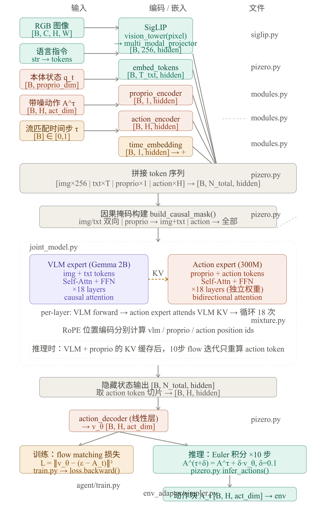

# π₀：Flow Matching 与数据流




## 核心思路

Conditional Flow Matching (CFM)：学习一个速度场 $v(x_t, t)$，把噪声 $x0$ "推" 到真实动作 $x1$。训练时在噪声-干净的插值路径上学速度，推理时用 Euler 积分沿速度场走 N 步。

---

## 一、Flow 路径定义 — `psi_t`（第 597-605 行）

```python
def psi_t(x, x1, t):  # x = x0 (噪声)
    t = t[:, None, None]  # (B,) → (B, 1, 1)
    return (1 - (1 - σ_min) * t) * x + t * x1

```

这是线性插值路径：噪声 `x0` 到干净动作 `x1` 的直线。`σ_min`（默认 0.001）保证 `t=1` 时仍有一点点噪声，避免数值问题。

* **t=0** → 纯噪声 `x0`
* **t=1** → `σ_min * x0 + x1 ≈ x1`
## 二、训练 — `forward`（第 607-661 行）

**输入：**

* 参数
* `input_ids`
* `pixel_values`
* `proprios`
* `actions`
* `t`
* `causal_mask`

**输出：**
* 标量 `loss = MSE(预测速度, 真实速度)`

**步骤：**

```python
1. x0 = randn_like(actions)              # 纯噪声
2. psi_t = psi_t(x0, actions, t)         # 噪声→干净的线性插值点
3. inputs_embeds = VLM(image + text)     # 图像文本编码
4. proprio_embeds = Linear(proprios)     # 本体感知投影
5. time_cond = SinusoidalPosEmb(t)       # 时间步编码
6. action_embeds = ActionEncoder(psi_t, [time_cond])  # 编码含噪动作
7. action_embeds = JointModel(           # 三路联合 Transformer
       {vlm, proprio, action}, time_cond
   )["action"]
8. v_psi = Linear(action_embeds)         # 解码为预测速度
9. d_psi = actions - (1-σ_min)*x0        # 真实速度 (直线方向)
10. loss = MSE(v_psi, d_psi)             # 目标：学习这个方向
```

**直观理解：**
在噪声→干净路径的某个中间点 `psi_t`，模型被训练输出"往干净方向的速度"。每个时间步 `t` 都随机采样，覆盖整个路径。
## 三、推理 — `infer_action`（第 416-490 行）

**输入：** 和训练相同，但没有 `actions`（那是要推理出的结果）。

**输出：** `(B, horizon_steps, action_dim)` — 预测的未来动作轨迹。

**步骤：**

```python
# Phase 1: 预计算 VLM + Proprio 的 KV Cache（不变）
1. inputs_embeds = VLM(image + text)     # 编码图像文本
2. proprio_embeds = Linear(proprios)
3. kv_caches = JointModel(               # 前向一次，缓存 KV
       {vlm, proprio}, cache=append
   )

# Phase 2: 从噪声出发，Euler 积分去噪
4. action = randn(B, horizon_steps, action_dim)  # 初始化：纯噪声
5. Δt = 1 / num_inference_steps
6. for step in range(num_inference_steps):
     time_cond = embed(t)
     action_embeds = ActionEncoder(action, [time_cond])
     action_embeds = JointModel(
         {action}, time_cond,
         kv_caches=vlm_proprio_cache,    # 复用缓存的 VLM/Proprio KV
         cache_mode="append_non_active"  # action 不写缓存
     )["action"]
     action_vel = Linear(action_embeds)   # 预测速度
     action += Δt * action_vel            # Euler 步进
     t += Δt

```

**关键优化：**
VLM 和 `proprio` 在推理时不变，KV cache 计算一次后复用。每个去噪步只重算 action expert（轻量），大幅节省计算。
