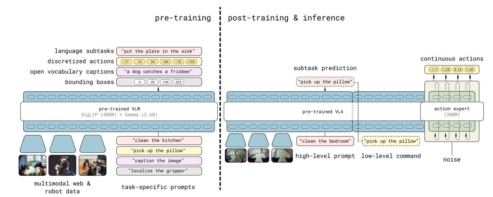
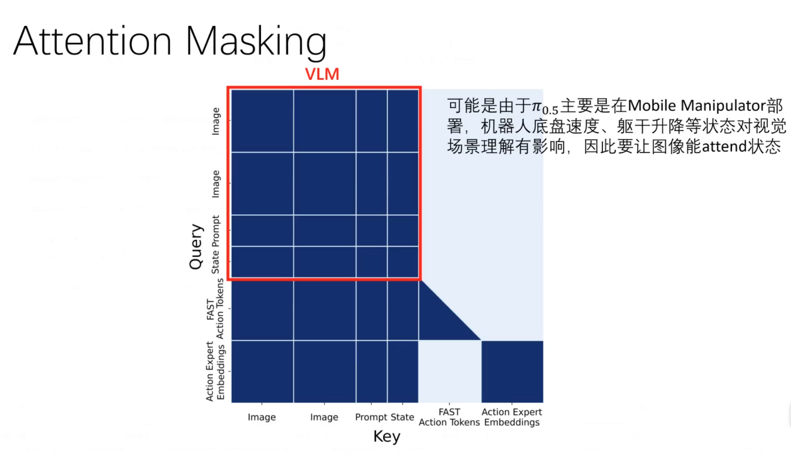

# π₀.₅：训练配方与泛化

[论文原文 · arXiv:2504.16054](https://arxiv.org/pdf/2504.16054)
## Paper Overview

* 背景：想让机器人在非实验室环境执行实际（操作）任务
* 问题（Gap）：VLA在真实开放环境中还没有泛化能力
> "How can we structure a **training recipe** for a robotic learning system that can enable this kind of flexible **generalization**?"
* 贡献：$\pi_0$对异构任务进行联合训练来赋予$\pi_0$迁移/泛化能力
* 方法：用跨本体、跨任务数据进行混合多模态训练
* 实验：在餐厅和卧室场景测试（并首次展现）$\pi_0$对长程（15分钟）灵巧操作的泛化能力（指标：任务进度）
## Motivations

范式由专才转向通才：
- 专才(Specialist): 单任务数据→单任务策略
- 通才(Generalist): 多场景/任务数据集→泛化到新场景/任务

VLA复刻VLM范式的局限：
* 理想：Pre-Training(互联网语义知识)→Fine-Tuning(下游操作任务)
* 局限1：缺少系统的Training Recipe来有效整合异构知识源
* 局限2：暴力scaling对复杂长程任务不奏效，线性数据增长无法覆盖指数级场景复杂度

* **Co-Training Recipe**：
* 整合不同构型机器人数据，覆盖不同任务类型，引入非机器人数据（网络图文、语义标注等）

* $\pi_{0.5}$模型架构：区别于传统双模型方案（VLM 规划 + 策略执行），PI 0.5 以单一模型实现CoT式推理

## Training recipe

### Problem Definition

* Imitation Learning $\rightarrow$ Next Token Prediction
* Imitation Learning Problem:
$$\max_{\theta} \mathbb{E}_{(\mathbf{a}_{t:t+H}, \mathbf{o}_t, \ell) \sim \mathcal{D}} \log \left( \pi_{\theta}(\mathbf{a}_{t:t+H} \vert{} \mathbf{o}_t, \ell) \right)$$

* Next Token Prediction:
$$L_1(\mathcal{U}) = \sum_i \log P(u_i\vert{}u_{i-k}, \dots, u_{i-1}; \Theta)$$
* 输入输出Token化 $\rightarrow$ Auto-Regressive Transformer Backbone

### Tokenizer的选择

| 模态                         | Tokenizer                      |
| -------------------------- | ------------------------------ |
| Image                      | SigLIP                         |
| Text                       | Gemma                          |
| Robot Proprioceptive State | 精度截断转文本后用 Gemma                |
| Bounding Box               | 归一化转为标签 `<locXXXX>` 后用 Gemma   |
| Action (Pre-Training)      | FAST-Tokenizer                 |
| Action (Fine-Tuning)       | Flow Matching + MLP Projection |

> bounding box is the specific location of the object, transferred to \<locXXXX\>

### Pre and post Training

> **配图待补**：原笔记中的预训练 / 后训练示意图文件缺失（`Pasted image 20260721142412.png`）。
> 在pre-training 部分，high-level subtask 是外部提供的数据
### Training Loss

$$\pi_\theta(\mathbf{a}_{t:t+H}, \hat{\ell} \vert{} \mathbf{o}_t, \ell) = \pi_\theta(\mathbf{a}_{t:t+H} \vert{} \mathbf{o}_t, \hat{\ell}) \pi_\theta(\hat{\ell} \vert{} \mathbf{o}_t, \ell)$$
* **Action Chunk Prediction**: $\pi_\theta(\mathbf{a}_{t:t+H} \vert{} \mathbf{o}_t, \hat{\ell})$
* **High-Level Subtask**: $\pi_\theta(\hat{\ell} \vert{} \mathbf{o}_t, \ell)$

$$\mathbb{E}_{\mathcal{D}, \tau, \omega} \left[ H(x_{1:M}, f_\theta^\ell(\mathbf{o}_t, \ell)) + \alpha \left\Vert{} \omega - \mathbf{a}_{t:t+H} - f_\theta^a(\mathbf{a}_{t:t+H}^{\tau, \omega}, \mathbf{o}_t, \ell) \right\Vert{}^2 \right]$$
- 预训练 $\alpha = 0$，后训练 $\alpha = 10$
* Cross-Entropy Loss of High-Level Text Prediction: $H(x_{1:M}, f_\theta^\ell(\mathbf{o}_t, \ell))$
* Flow Matching Loss of Action Expert: $\left\Vert{} \omega - \mathbf{a}_{t:t+H} - f_\theta^a(\mathbf{a}_{t:t+H}^{\tau, \omega}, \mathbf{o}_t, \ell) \right\Vert{}^2$

论文原文：
> "$H(x_{1:M}, y^\ell_{1:M})$ is the cross entropy loss between the text tokens and predicted logits (including the FAST encoded action tokens)"

所以 $x_{1:M}$ 是 ground-truth 离散 token 序列（文本 + FAST 动作 token），$f_\theta^\ell(\mathbf{o}_t, \ell)$
是 VLM backbone 输出的对应 logits。

## Pre-Training

* Training Steps: 280k
* Data Format: all tasks are represented in discrete tokens (actions encoded into discrete tokens via FAST tokenizer)
* Mixture Sampling: all data types are trained simultaneously in a mixed manner

| **数据类别** | **缩写** | **内容描述** | **比例/规模** |
|---|---|---|---|
| 移动机械臂数据 (Mobile Manipulators) | MM | 在约100个家庭环境中收集的移动机械臂操作数据 | 约400小时 |
| 非移动多环境数据 (non-mobile Multi-Environments) | ME | 使用更轻便的(单臂/双臂)机械臂在多种家庭环境中收集的数据 | 未明确具体小时数，但属于主要机器人数据来源 |
| 跨构型实验室数据 (lab Cross-Embodiment) | CE | 包含OXE开源数据集（Bridge v2、DROID等）的实验室条件数据 | 9.1%的预训练混合数据（参考π0的OXE Magic Soup比例） |
| 高层子任务预测数据 (High-Level subtask prediction) | HL | 为多阶段任务手动标注语义子任务描述和边界框 | 来自MM、ME、CE中含多子任务的数据 |
| 多模态网络数据 (multi-modal Web Data) | WD | 图像描述、视觉问答（VQA）、目标检测等网络数据 | 未明确具体比例，但用于提供语义和视觉能力 |

## Post-Training (Fine-Tuning)

* Training Steps: 80k
* CE removed
* VI added
* Action Expert using Flow Matching introduced

| **数据类别**                                  | **缩写** | **内容描述**                      | **比例/规模**       |
| ----------------------------------------- | ------ | ----------------------------- | --------------- |
| 移动机械臂数据 (Mobile Manipulators)             | MM     | 在约100个家庭环境中收集的移动机械臂操作数据       | 过滤为成功且长度低于阈值的片段 |
| 非移动多环境数据 (non-mobile Multi-Environments)  | ME     | 使用更轻便的(单臂/双臂)机械臂在多种家庭环境中收集的数据 | 过滤为成功且长度低于阈值的片段 |
| 口头指令 (Verbal Instructions)                | VI     | 由专家用户在机器人执行任务时口述当前应执行的子任务     | 未披露             |
| 高层子任务预测数据 (High-Level subtask prediction) | HL     | 为多阶段任务手动标注语义子任务描述和边界框         | 仅保留ME中含多子任务的数据  |
| 多模态网络数据 (multi-modal Web Data)            | WD     | 图像描述、视觉问答（VQA）、目标检测等网络数据      | 维持模型的语义和视觉能力    |

### Data Flow

---

## **「Sonnet Generated」** π 0.5 相对于 π₀ 的改进

### 1. 离散+连续动作双表示（FAST + Flow Matching 混合训练）

π₀ 整个训练过程始终使用 flow matching（连续动作，Action Expert）。π₀.5 引入了 **FAST tokenizer**（一种基于 DCT 压缩的动作离散化方案），将训练分成两阶段：

**预训练阶段**（α = 0）：动作用 FAST 离散 token 表示，以标准自回归 next-token prediction 训练，速度快、规模易扩展。

**后训练阶段**：同时优化两个目标——

$$\mathcal{L} = \mathbb{E}\left[ H\left(x_{1:M}, f^\ell_\theta(o_t, \ell)\right) + \alpha \left\| \omega - a_{t:t+H} - f^a_\theta(a^{\tau,\omega}_{t:t+H}, o_t, \ell) \right\|^2 \right]$$

其中 $\alpha = 10.0$，两个 action head（FAST token 和 flow matching Action Expert）共存但通过 attention mask 隔离，避免信息泄漏。

**实际收益**：预训练时用 FAST token 比纯 diffusion 训练计算效率更高；推理时用 flow matching（10步去噪）获得高精度连续动作。

---

### 2. 内嵌的层级推理（高层 + 低层统一模型）

π₀ 中高层规划（VLM）和低层控制（π₀）是两个独立模型，靠语言接口串联。

π₀.5 将两者**合并为单一模型**，联合建模：

$$\pi_\theta(a_{t:t+H}, \hat{\ell} \mid o_t, \ell) = \pi_\theta(a_{t:t+H} \mid o_t, \hat{\ell}) \cdot \pi_\theta(\hat{\ell} \mid o_t, \ell)$$

推理时的执行顺序：
1. 模型先自回归输出 $\hat{\ell}$（当前子任务，例如 "pick up the plate"）
2. 再以 $\hat{\ell}$ 为条件，flow matching 输出低层动作块

高层推理以 **较低频率**运行（不是每步都重新预测子任务），低层 action chunk 以 50Hz 执行。这类似 chain-of-thought，但专门为机器人控制中的时间异步性设计。

消融实验表明：显式高层推理 > 隐式（仅训练含子任务标注数据但推理时不输出）> 完全没有高层数据，且 π₀.5 甚至超过了人类作为 oracle 高层策略的基线。

---

### 3. 异构数据协训练（Co-training）

π₀ 的训练数据基本都是机器人动作数据（imitation learning）。π₀.5 在数据层面做了根本性扩展，将以下数据源统一进同一个 VLA 序列建模框架：

| 数据类型                            | 来源                                           | 作用               |
| ------------------------------- | -------------------------------------------- | ---------------- |
| **MM**：移动机械手                    | ~400h，~100个真实家庭                              | 最直接的目标域数据        |
| **ME**：多环境非移动臂                  | 轻便单/双臂，更易采集于多家庭                              | 跨本体泛化            |
| **CE**：实验室跨本体数据                 | 含 OXE，多种机器人类型                                | 多任务技能迁移          |
| **HL**：高层子任务标注                  | 对 MM/ME/CE 数据手工标注子任务                         | 教模型场景语义推理        |
| **WD**：多模态网络数据                  | 图像字幕（COCO/CapsFusion）、VQA、目标检测（bounding box） | 增强 OOD 物体识别和语言理解 |
| **VI**：语言示范（Verbal Instruction） | 人类用语言"遥操作"已训练低层策略来演示子任务序列                    | 提升高层推理策略质量       |

97.6% 的预训练数据**不来自**移动机械手家务任务，但模型最终能在全新家庭中泛化——这验证了跨域迁移的有效性。消融结果显示去掉 ME 或 CE 都会显著降低性能；去掉 WD 对 OOD 物体语言跟随损害最大。

---

### 4. 时间步注入方式的细节改动（Action Expert 架构微调）

π₀ 将 flow matching 时间步 $\tau$ 与带噪动作 $a^{\tau,\omega}$ 拼接后一起输入 Action Expert。

π₀.5 改为**独立 MLP + adaptive RMSNorm** 的方式注入 $\tau$：

$$\phi(\tau) \xrightarrow{\text{sinusoidal}} \text{swish}(W_2 \cdot \text{swish}(W_1 \cdot \phi(\tau)))$$

然后对 Action Expert 每一层的激活施加 adaptive RMSNorm（类似 DiT 中的 AdaLN），让时间步信息以"调制归一化"方式渗透整个 Action Expert，而非只影响输入层。

---

### 5. 注意力掩码重新设计

π₀ 的 Action Expert token 可以全局双向互相 attend。

π₀.5 更精细：
- 图像/语言/本体感知构成 prefix，全局双向 attend
- FAST 动作 token 自回归地 attend prefix + 之前的 FAST token
- Action Expert token attend prefix + 彼此，**但不 attend FAST token**（防止两种动作表示之间信息泄漏）
- VLM 的 embedding 不 attend Action Expert（信息单向流动：VLM → Action Expert）

---

### 总结对比

| 维度 | π₀ | π₀.5 |
|---|---|---|
| 动作表示 | 全程 flow matching | 预训练用 FAST 离散 token，后训练加 flow matching |
| 高层策略 | 外挂独立 VLM | 统一模型内嵌，联合推理 |
| 数据来源 | 机器人演示 + OXE | 机器人演示 + 多环境非移动臂 + 网络数据 + 子任务标注 + 语言示范 |
| $\tau$ 注入 | 拼接输入 | 独立 MLP + adaptive RMSNorm 调制每层 |
| 注意力 | VLM 因果 + Action Expert 双向 | 增加 FAST/Expert 隔离掩码，单向信息流 |
| 评估场景 | 实验室 + 已见任务 | **全新家庭，完全未见场景** |
